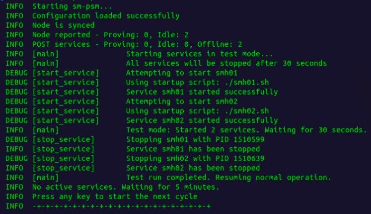

# Spacemesh Post Service Manager (sm-psm)

sm-psm is an advanced tool designed for unattended management of Spacemesh Post Services. It offers a flexible and robust solution for automating the Spacemesh proving process across a wide range of Linux-based operating systems.

## Key Features:

- **Automated Service Management**: Intelligently starts services when required and stops them upon completion of the proving process.
- **Flexible Configuration**: Supports various configuration options to adapt to different system setups and requirements.
- **Customizable Execution Order**: Allows services to be started individually in a specified sequence or in groups, optimizing resource utilization.
- **Process Monitoring**: Actively monitors services, tracking the completion of the Proof of Work (POW) phase of the proving process.
- **Wide Compatibility**: Designed to work with most Linux-like operating systems, ensuring broad usability across different environments.

sm-psm streamlines the Spacemesh post-service management, making it an essential tool for node operators seeking efficient and hands-off operations.

## Important Notes:

- sm-psm manages post services connected to one node. For multiple nodes with different cycle gaps, run separate instances of sm-psm for each node.
- sm-psm must run on the host where your POS files are located. The node itself can be on a different host.
- To ensure correct operation, create start-up scripts for each POS set. These scripts allow sm-psm to start and stop post services. (See examples: smh01.sh and smh02.sh)

## Configuration:

- The configuration file is similar to the one used by [sm-monitor](https://github.com/xeliuqa/SM-Monitor). If you're using sm-monitor, you can copy the node and services lines (for one node only).
- List post services in the order you want them to start.
- Behavior of sm-psm can be customized using two key variables:
  - `max_POW`: Sets the number of post services allowed to perform stage 1 (POW) of proving simultaneously.
  - `max_Services`: Sets the total number of post services that can run simultaneously.

## Usage Examples:

1. Sequential operation (one at a time).<br />
   Next service starts only after the previous one finishes proving.
   ```
   max_POW=1
   max_Services=1
   ```
   
2. POW-limited parallel operation.<br />
   Next service starts after the previous one finishes POW, allowing two post services to run simultaneously.
   ```
   max_POW=1
   max_Services=2
   ```

6. Parallel operation with POW limit.<br />
   Four services can perform POW simultaneously, while others wait. No limits on the disk proving. 
   ```
   max_POW=4
   max_Services=999
   ```
   

## Testing:

To verify if everything is set up correctly, you can use the test mode:

```
test=1
```

This will attempt to start all services and close them after 30 seconds. If this works without issues, your setup is good to go.
You will see something like this:



Happy smeshing!


<br />
If you find sm-psm useful, consider showing your gratitude by sending a coffee tip to:

`sm1qqqqqq9cj9gk70w5uk9yel9vcwg65xfyu8v36esh9qv93`

Your support helps maintain and improve tools for the Spacemesh community.
